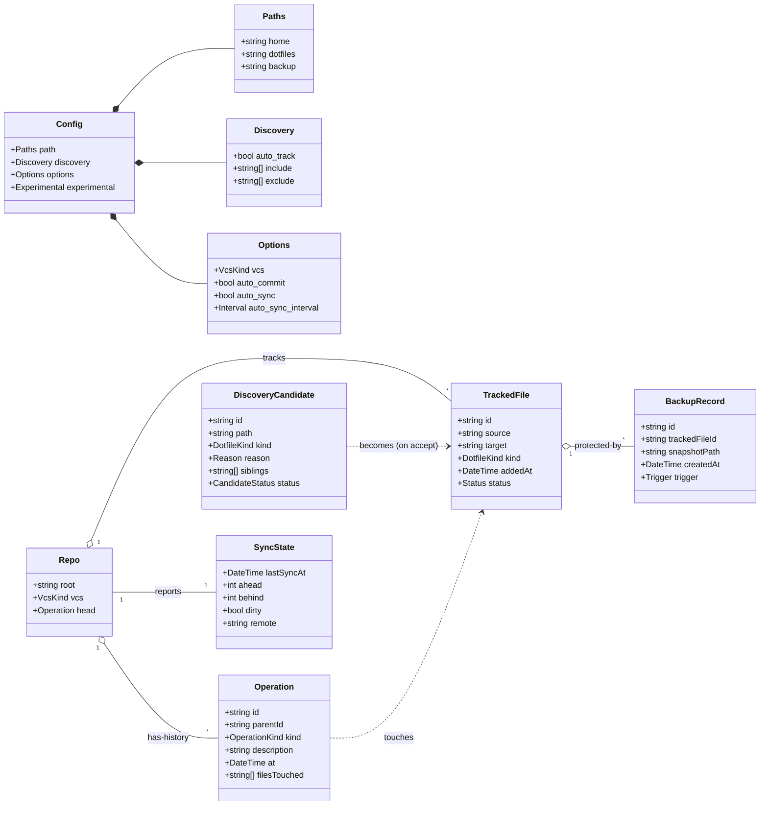
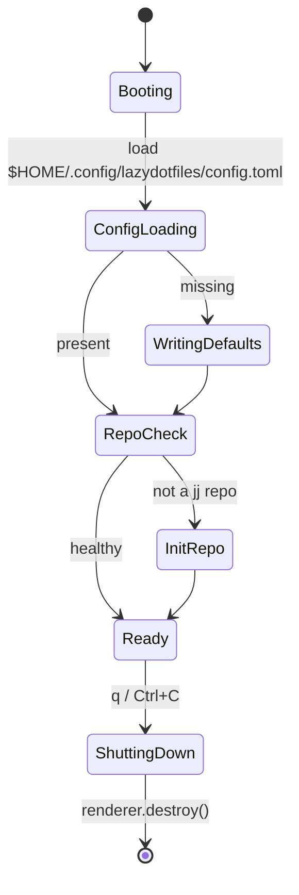
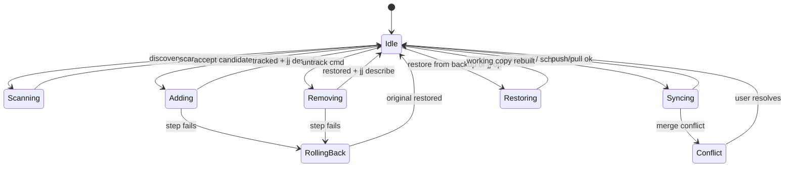
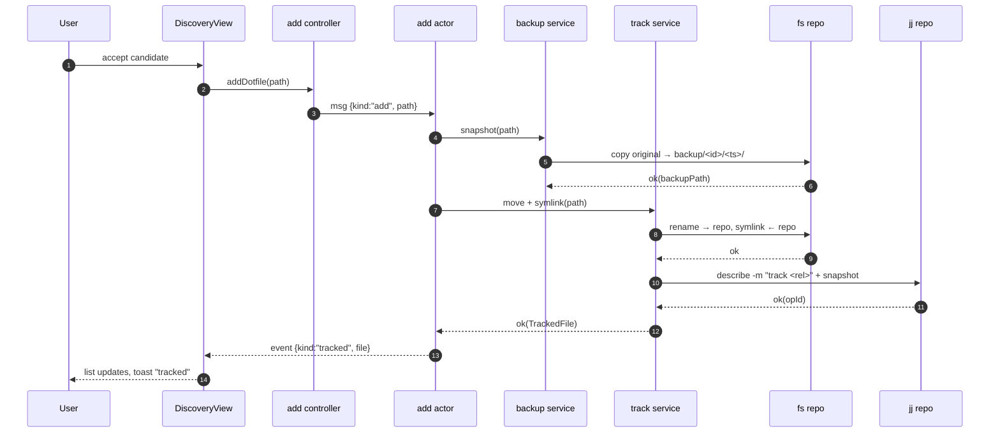

# PRD-001: `lazydotfiles` MVP

| Revision | Date       | Author |
| -------- | ---------- | ------ |
| 1        | 2026-05-01 | core   |

The key words "**MUST**", "**MUST NOT**", "**REQUIRED**", "**SHALL**", "**SHALL NOT**", "**SHOULD**", "**SHOULD NOT**", "**RECOMMENDED**", "**MAY**", and "**OPTIONAL**" in this document are to be interpreted as described in [RFC 2119](https://www.rfc-editor.org/rfc/rfc2119).

This PRD scopes the **first shippable version** of `ldf` (`lazydotfiles`). It is bound by [CONSTITUTION](../CONSTITUTION.md), [ADR-001](../adrs/001_project.md), and [ADR-002](../adrs/002_tui.md). Anything that contradicts those documents is out of scope.

---

## 1. Summary

`ldf` is a TUI that discovers, tracks, and versions a user's dotfiles in a single `jj` repository at `$HOME/dotfiles`, with symlinks back to their original locations. It removes the manual ceremony of `stow`-style workflows: discovery is automatic, every change is captured by `jj`, and an operation log makes time-travel and recovery first-class.

The MVP delivers the round-trip a real user needs: **discover → track → version → sync → restore**, end-to-end, with no data loss.

## 2. Goals

- **G1.** `ldf` (no args) launches the TUI; on first run it bootstraps config + repo non-interactively with safe defaults.
- **G2.** A user can identify candidate dotfiles through automatic discovery, accept/reject them from a queue, and detect siblings of an accepted file (e.g. accepting `~/.config/fish/config.fish` surfaces `~/.config/fish/**/*` for review).
- **G3.** Adding a tracked file moves it into the dotfiles repo, replaces it with a symlink, and records a `jj` change with a meaningful description — atomically, with a recoverable backup.
- **G4.** Removing a tracked file restores the file to its original location with the latest content from the symlink target, preserving the `jj` history.
- **G5.** `ldf status`, `ldf log`, `ldf add`, `ldf rm`, `ldf config`, `ldf sync` all work as documented in `README.md`. Each non-TUI subcommand is a thin shell over the same services that back the TUI.
- **G6.** Sync (`ldf sync` or auto-sync on schedule) pushes/pulls the repo to/from a configured remote and surfaces conflicts in the TUI.
- **G7.** No destructive operation runs without a recoverable backup. Restore from backup is one keystroke from any operation in the log.

## 3. Non-goals

The following are explicitly **out of MVP**:

- N1. Multi-profile / multi-machine selection (one profile per machine; ADR-001 leaves the type in for future use).
- N2. API-key sanitization (`experimental.detect_api_keys`) — listed as experimental in `README.md`; tracked separately.
- N3. Templated dotfiles (e.g. `{{hostname}}` substitution).
- N4. Bidirectional conflict UI beyond "show the conflict, let the user pick". Three-way merge editor is post-MVP.
- N5. Arbitrary VCS backends. `vcs = "jj"` is the only supported value in MVP; `git` may follow.
- N6. Network-discovered remotes / OAuth flows. The remote URL **MUST** be configured by the user (env, config file, or `ldf config`).
- N7. Background daemon. Auto-sync runs only while the TUI is open or when `ldf sync` is invoked from cron/launchd by the user.

## 4. Personas & Actors

### 4.1 User personas

| Persona             | Need                                                                 |
| ------------------- | -------------------------------------------------------------------- |
| New user            | Bootstraps a dotfiles repo without reading docs; safe defaults work. |
| Existing dotfiler   | Already has dotfiles scattered; wants discovery to surface them.     |
| Multi-machine power | Wants one source of truth, sync on a schedule, conflict visibility.  |
| Recovery user       | Broke a config; wants to roll back to a known-good snapshot in <30s. |

### 4.2 System actors (per ADR-002 actor model)

| Actor                  | Owns                                                              |
| ---------------------- | ----------------------------------------------------------------- |
| `config` actor         | Loaded `Config`, mutations, persisted writes through repo.        |
| `discovery` actor      | Scan progress, candidate queue, decisions (accept/reject/defer).  |
| `repo` actor           | Tracked-file list, current `jj` op log, last operation status.    |
| `add` / `remove` actor | Atomic file ops (snapshot → move → symlink → describe / inverse). |
| `sync` actor           | Schedule, push/pull state, conflict surface.                      |
| `ui` actor             | Modal stack, current focus context, toast/error queue.            |

```mermaid
flowchart LR
    User(["User"])
    CLI["ldf CLI"]
    TUI["ldf TUI"]
    subgraph Actors["Actor runtime"]
        ConfigA["config actor"]
        DiscoveryA["discovery actor"]
        RepoA["repo actor"]
        AddA["add/remove actor"]
        SyncA["sync actor"]
        UIA["ui actor"]
    end
    subgraph Services["Service layer"]
        ConfigSvc["config service"]
        DiscoverySvc["discovery service"]
        TrackSvc["track service"]
        SyncSvc["sync service"]
        BackupSvc["backup service"]
    end
    subgraph Repos["Repository layer"]
        FsRepo[("filesystem")]
        JjRepo[("jj repo")]
        ConfigRepo[("config.toml")]
        BackupRepo[("backup dir")]
    end

    User --> CLI
    User --> TUI
    CLI --> Services
    TUI --> Actors
    Actors --> Services
    Services --> Repos
```



## 5. Core Features

### F1. First-run bootstrap

`ldf` (no args) **MUST** load `$HOME/.config/lazydotfiles/config.toml`. If absent:

1. Write the default config (per `README.md`) with `home`, `dotfiles`, `backup` resolved against `$HOME`.
2. If `$HOME/dotfiles` does not exist or is not a `jj` repo, run `jj git init $HOME/dotfiles` (colocated git backend per repo guidance).
3. If `$HOME/.dotfiles.bak` does not exist, create it.
4. Open the TUI on the **Status** view.

Bootstrap **MUST** be idempotent. A second launch on a healthy install is a no-op except for opening the TUI.

### F2. Discovery

A scan reads `discovery.include`/`discovery.exclude` globs (relative to `home`) and produces `DiscoveryCandidate`s. Behaviors:

- **Sibling detection.** When a candidate is accepted, the discovery service inspects its parent directory and surfaces other entries under the same directory (recursively, to a configurable depth, default `4`) as new candidates with `reason = "sibling-of"`. This satisfies `~/.config/fish/**/*` once the user accepts a single file under `~/.config/fish/`.
- **Auto-track.** If `discovery.auto_track = true`, candidates whose path matches a non-glob include (e.g. `.zshrc`) skip the queue and are added directly. Glob includes always go to the queue.
- **Re-scan.** On TUI launch and on demand (`r` keybinding); discovery never blocks the UI thread (effect-driven per ADR-002).

### F3. Add (track)

The atomic add operation:

1. **Validate.** Target exists, is not already a symlink into `dotfiles`, is not under `dotfiles`.
2. **Snapshot.** Copy original to `$HOME/.dotfiles.bak/<id>/<timestamp>/` preserving permissions.
3. **Move.** `Bun.write` (or `node:fs.rename` if cross-device) the file into `<dotfiles>/<relativePath>`.
4. **Symlink.** Replace the original location with a symlink pointing into the dotfiles repo.
5. **Describe.** `jj describe -m "track <relativePath>"` and snapshot working copy (`jj snapshot`).
6. **Record.** Persist a `TrackedFile` entry; emit `Tracked` event.

If any step fails, the operation rolls back: restore from snapshot, remove partial symlink, leave `jj` repo untouched. The user **MUST** see an error toast with the rollback result.

### F4. Remove (untrack)

The inverse:

1. **Validate.** Path is a tracked symlink owned by `ldf`.
2. **Snapshot.** Copy current target content (the file in the dotfiles repo) into `$HOME/.dotfiles.bak/<id>/untrack-<timestamp>/`.
3. **Materialize.** Copy the file back to the original location, replacing the symlink.
4. **Untrack in repo.** `jj describe -m "untrack <relativePath>"` after deleting the file from the working copy, then snapshot.
5. **Record.** Update `TrackedFile.status = "untracked"`; emit `Untracked` event.

History in `jj` is preserved; the file simply disappears from the working copy on the latest change.

### F5. Operation log

`ldf log` and the `/log` view read `jj op log` and `jj log` and project them to a unified domain `Operation` stream:

- Hash, description, timestamp, parent, files touched, kind (`init|track|untrack|edit|sync`).
- Selecting an operation shows the diff (per-file, semantic where `jj` provides it).
- "Restore to here" → `jj op restore <id>`, which rewinds the working copy and re-materializes symlinks via the repo actor.

### F6. Sync

`ldf sync` (and the `/sync` view) runs `jj git fetch` then `jj git push` against the configured remote.

- Conflicts surface as a list with per-file resolution choices (accept ours, accept theirs, open in `$EDITOR`). Three-way merge UI is **out of scope** (N4); MVP routes to `$EDITOR`.
- `options.auto_sync = true` schedules the sync at `auto_sync_interval` (`hourly|daily|weekly`) only while the TUI is open. Cron/launchd integration is the user's responsibility.

### F7. Backup & restore

- Every destructive op writes to `$HOME/.dotfiles.bak/<id>/<timestamp>/`. Backups are addressable.
- `/log` and the toast-action stream both expose **Restore from backup** as the recovery path independent of `jj`.
- A scheduled GC (out of MVP, tracked) **MAY** prune backups older than N days; for MVP, backups grow unbounded and are visible in `ldf status`.

### F8. CLI surface

| Command               | Behavior                                                                |
| --------------------- | ----------------------------------------------------------------------- |
| `ldf`                 | Bootstrap if needed, open TUI on Status.                                |
| `ldf status`          | Print: tracked count, queue size, last sync, dirty repo flag.           |
| `ldf log`             | Print operation log (paged).                                            |
| `ldf add <path>`      | Run F3 against `<path>`. Prints result; non-zero on failure.            |
| `ldf rm <path>`       | Run F4 against `<path>`.                                                |
| `ldf config [option]` | Print or set a config option (`ldf config discovery.auto_track false`). |
| `ldf sync`            | Run F6 once. Prints summary; non-zero on conflict or push failure.      |

CLI subcommands **MUST** call the same services the TUI uses (per ADR-001 §4.5). No business logic lives in the CLI entry.

## 6. Domain Model



**Identities & invariants:**

- `TrackedFile.id = sha256(target)` (stable across moves of the dotfiles repo).
- `TrackedFile.target` is unique per `Repo` (enforced in `repoWithTrackedFile` aggregate root, mirroring ADR-001 §4.2).
- `DiscoveryCandidate.path` is absolute and unique within the queue.
- `BackupRecord.snapshotPath` is read-only after creation. Snapshots are never overwritten.

## 7. State & App Lifecycle

### 7.1 Process lifecycle



`Booting → Ready` runs entirely in the composition root before the TUI renders, so the user never sees a half-bootstrapped UI.

### 7.2 Operating substates (Ready)



Every transition out of `Idle` is triggered by an actor message; every transition back to `Idle` emits an event the views subscribe to. Failures route through `RollingBack` — there is no path that leaves the system in a partial state.

### 7.3 Add operation (sequence)



Failure at any step replays the inverse operations up to that point and emits `event {kind:"addFailed", reason}`.

## 8. Views Inventory

All views live under `src/views/panels/` and are wired into routes per ADR-002 §4.2. Layout uses Yoga flexbox only (constitution §2.2). Tokens come from `useTheme()`.

### 8.1 Status (`/`)

**Purpose.** Single-glance health: is the repo OK, what is queued, when did we last sync.

**Content.**

- Header: repo path, branch, dirty flag.
- Cards (3-up, equal `flexGrow={1}`):
  - **Tracked.** Count of `TrackedFile` with `status=tracked`.
  - **Discovery queue.** Count of `pending` candidates. Click → `/discover`.
  - **Sync.** `lastSyncAt` relative, ahead/behind, remote URL.
- Recent operations: last 5 from `Operation` stream, navigates to `/log` on focus.
- Toast/error rail (1-line `height={1}`, anchored bottom).

**Layout.**

```
┌── header ─────────────────────────┐
│ repo path · branch · dirty flag    │
├────────────────────────────────────┤
│ ┌Tracked─┐ ┌Queue──┐ ┌Sync──────┐  │  flexDirection=row, gap=md
│ │  42    │ │   7   │ │  2m ago  │  │  each: flexGrow=1
│ └────────┘ └───────┘ └──────────┘  │
│                                    │
│ Recent operations                  │  flexGrow=1, scrollable
│  • track .config/fish/config.fish  │
│  ...                               │
├── status bar ──────────────────────┤  height=1
│ q quit  ? help  s sync  r rescan   │
└────────────────────────────────────┘
```

### 8.2 Discovery (`/discover`)

**Purpose.** Triage the candidate queue.

**Content.**

- Master/detail (sidebar + main, `flexDirection="row"`):
  - Sidebar (`flexBasis=40`): grouped list of candidates by parent directory; `Reason` badge (`include`, `sibling-of`, `auto`); `pending|accepted|rejected` filter.
  - Main: focused candidate detail — absolute path, kind, file size, first 200 lines (read-only), siblings list (if present).
- Footer keymap: `a` accept, `r` reject, `d` defer, `o` open in `$EDITOR`, `space` expand siblings.

**Edge cases.** Empty queue → centered empty state, `flexGrow=1` + `justifyContent/alignItems="center"`.

### 8.3 Tracked (`/tracked`)

**Purpose.** Review and manage actively tracked files.

**Content.**

- Table-shaped list (rows of `flexDirection="row"`, no CSS grid per constitution §2.2):
  - Columns: target path · kind · added · last touched · backup count.
- Detail pane: link target, source path, current symlink validity, backup history (entries from `BackupRecord`).
- Actions: `u` untrack, `b` browse backups, `Enter` show in `/log` filtered by file.

### 8.4 Log (`/log`)

**Purpose.** `jj` operation log as a navigable timeline.

**Content.**

- Left: chronological list of `Operation`s — kind icon · description · short hash · relative time.
- Right: per-op detail — full description, files touched, diff preview (paged).
- Actions: `Enter` open diff, `R` "restore working copy to this op" (calls `jj op restore`), `B` "restore from backup at this point".

**Layout.** `flexDirection="row"`, sidebar `flexBasis=42`, detail `flexGrow=1`. Diff pane scrollable, body `flexGrow=1`.

### 8.5 Sync (`/sync`)

**Purpose.** Visualize and drive sync.

**Content.**

- Header: remote URL, branch, ahead/behind counts.
- Action row: `[Fetch] [Push] [Sync (fetch+push)]` (focusable buttons, `flexDirection="row" gap=md`).
- Body:
  - On clean state: last sync time, schedule (next auto-sync if enabled).
  - On in-flight: progress (`fetching…`, `pushing…`).
  - On conflict: list of conflicted paths with per-file `[Ours] [Theirs] [Edit]` actions.
- Footer: shortcut hints.

### 8.6 Config (`/config`)

**Purpose.** Read and edit `config.toml` without leaving the TUI.

**Content.**

- Sections (`Paths`, `Discovery`, `Options`, `Experimental`) rendered as labeled forms.
- Each field: label · current value · `Enter` to edit (input opens in a focused modal).
- Save action writes back through the config service. Validation errors surface inline before save.

### 8.7 Help overlay (modal)

**Purpose.** Discoverability for keybindings (per ADR-002 §4.5, derived from `globalKeymap`).

**Content.** Two columns of `keys → description`. Closes on `?` or `Esc`.

### 8.8 Confirmation modals

Every destructive op (add, remove, restore) routes through a confirmation modal:

- Title (one line), summary of what will happen, explicit list of paths affected, backup destination, two buttons (`[Confirm]`, `[Cancel]`). `Esc` cancels.

### 8.9 View → state subscriptions

| View      | Reads from                         | Writes via                                     |
| --------- | ---------------------------------- | ---------------------------------------------- |
| Status    | `repo`, `discovery`, `sync`        | none (read-only)                               |
| Discovery | `discovery`, `repo`                | `discovery` (accept/reject), `add` (on accept) |
| Tracked   | `repo`, `BackupRecord`s via `repo` | `remove`                                       |
| Log       | `repo` operations                  | `repo` (restore op)                            |
| Sync      | `sync`                             | `sync` (fetch/push/resolve)                    |
| Config    | `config`                           | `config` (write)                               |

## 9. Acceptance Criteria

The MVP ships when **all** are demonstrably true on a clean macOS or Linux user account:

- **A1.** A user with no prior config runs `ldf`, sees the Status view in <500ms with default config and an initialized `jj` repo at `$HOME/dotfiles`.
- **A2.** Discovery surfaces `~/.zshrc`, `~/.config/fish/config.fish`, and at least the siblings of any accepted file. Auto-track on a non-glob include lands the file without queue interaction.
- **A3.** Accepting a candidate produces: a backup at `$HOME/.dotfiles.bak/<id>/<ts>/`, a moved file under `$HOME/dotfiles`, a working symlink in the original location, and a `jj` change with description `track <relpath>`.
- **A4.** `ldf rm <path>` (or the TUI equivalent) restores the file at its original location with the latest committed content; `jj log` retains history.
- **A5.** Killing `ldf` mid-add (SIGTERM) leaves the filesystem in a recoverable state: either fully tracked or fully restored, never half. (Enforced via the rollback path, asserted in an integration test.)
- **A6.** `ldf sync` against a configured remote performs fetch+push and reports ahead/behind correctly; conflicts list the affected paths.
- **A7.** Restoring from `jj op log` rewinds the working copy and re-materializes symlinks; the user does not need to leave the TUI.
- **A8.** All non-trivial services and reducers have unit tests (constitution §3.1). Repository layer has integration tests against `fs.mkdtemp` directories. View panels have at least one snapshot test each.
- **A9.** No `process.exit()` outside the binary entry. No hand-rolled width/height for layout flow. No hex literals outside `views/theme/`.

## 10. Open Questions

These do **not** block the PRD from moving into design but **MUST** be resolved before the corresponding feature lands:

- **Q1 (sync).** Does MVP require GPG signing of commits? Default: **no**, document for v1.1.
- **Q2 (discovery).** Should `discovery.exclude` use gitignore semantics or globs only? Default: **gitignore semantics** (negation `!pattern` already implied by README example).
- **Q3 (backup).** Cap on backup retention? Default: **none for MVP**; surface size in Status; add GC in a follow-up.
- **Q4 (jj backend).** `jj git init` (colocated) vs. `jj init` (native). Default: **colocated** so users can `git push` to GitHub without extra setup.

## 11. Cross-references

- Architecture and folder layout: [ADR-001](../adrs/001_project.md).
- TUI runtime, actor protocol, theme, keymap: [ADR-002](../adrs/002_tui.md).
- Engineering rules: [CONSTITUTION](../CONSTITUTION.md).
- User-facing surface: [README](../../README.md).
